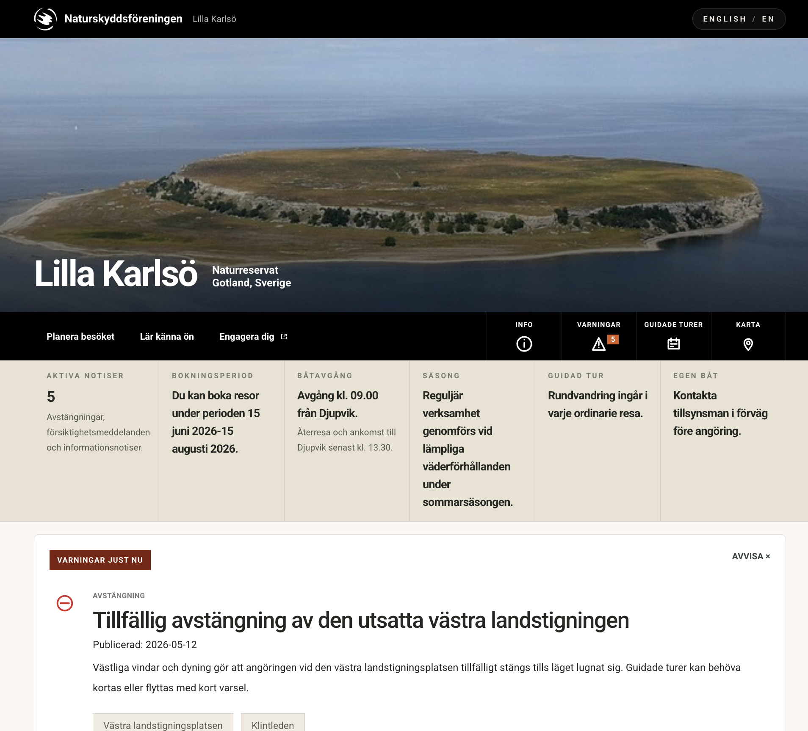

# Lilla Karlsö

Lightweight Astro site for the Lilla Karlsö nature reserve.

## Current Direction

The project is currently being shaped as a reserve information system rather than a landing page:

- operational homepage with reserve status, alerts, booking window, boat departures, and visitor guidance
- shared header and utility navigation across all pages
- current conditions page modeled after a real park alert system
- reserve administration, geology, wildlife, and grazing history integrated into the content structure
- bilingual Swedish/English routing and content

## Homepage Progress Snapshot

Current homepage screenshot:



## Project Structure

- `src/components`: page and UI components
- `src/content/sv` and `src/content/en`: structured reserve content
- `src/lib/content.ts`: content schema and loading
- `public/images`: static images and logos

## Local Development

```bash
npm install
npm run dev
```

## Validation

```bash
npm run check
npm run build
```
